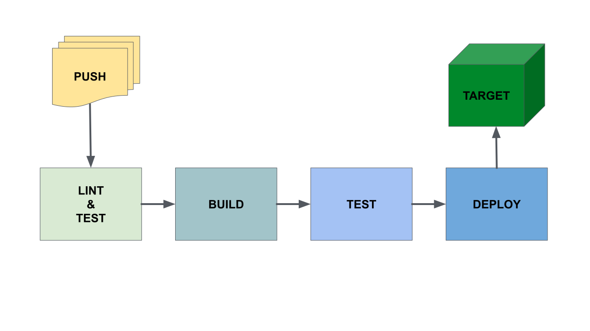

# 03_01 Plan Your CI/CD Pipeline

Before you build your first GitHub Actions workflow, it helps to understand how CI/CD pipelines work and what they’re designed to do.

This lesson introduces the core stages of a CI/CD pipeline—like testing, building, and deploying—and explains how GitHub Actions can help you automate these tasks.

By the end of this lesson, you'll have a solid mental model for how to organize your pipeline from start to finish.

## Overview

In this lesson, you’ll learn:

- What a CI/CD pipeline is and why it's used in software development.
- The main goals of **Continuous Integration** (CI).
- How **Continuous Deployment** (CD) works and its role in the delivery process.
- The key stages of a typical CI/CD pipeline.
- How to plan a workflow in GitHub Actions that includes linting, testing, building, and deploying.

## Lesson Notes

### What is a CI/CD Pipeline?

- A **pipeline** refers to the process of moving code from development into a production environment.
- This process is commonly known as **Continuous Integration and Continuous Deployment (CI/CD)**.
- GitHub Actions is a powerful tool that helps automate each part of this process, including testing, building, and deploying.

### Continuous Integration (CI)

- **The goal of CI is to detect and resolve problems early in the development cycle**.
- Developers work in local environments and commit their changes to a shared repository.
- These changes are integrated with existing code, and tests are run to ensure the code works as expected.
- Early testing reduces bugs and improves team collaboration.

### Continuous Deployment (CD)

- Once code is integrated, it’s compiled into **artifacts**—packages that can be used in later stages.
- These artifacts undergo further testing to ensure quality.
- After testing, the artifacts are **deployed** to environments where they can be used by end users.

### Building a CI/CD Pipeline with GitHub Actions

- A typical GitHub Actions workflow can be triggered on each push to the `main` branch.
- The workflow runs a series of **jobs** in sequence.

### Example Workflow Plan

1. **Lint and test the code** to catch syntax errors and verify logic.
1. **Build a container image** using a Dockerfile and the repository code and **upload the image** to GitHub Package Registry to make it available for deployment.
1. **Test the image** in a virtual environment to ensure it performs as expected.
1. **Deploy the image** to a target environment once it’s verified and ready.

<!-- FooterStart -->
---
[← 02_08 Solution: Develop a Workflow That Creates Artifacts](../../ch2_selecting_and_using_actions/02_08_solution_develop_a_workflow_that_creates_artifacts/README.md) | [03_02 Linting and Unit Tests →](../03_02_linting_unit_tests/README.md)
<!-- FooterEnd -->
