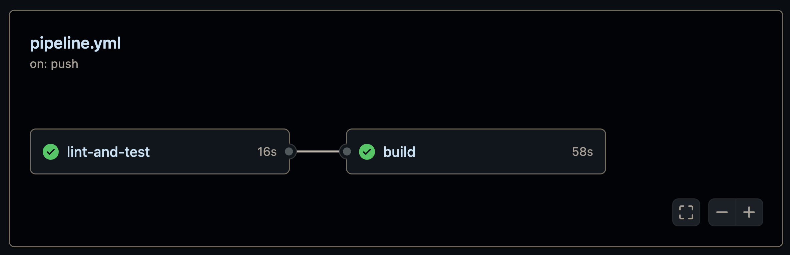
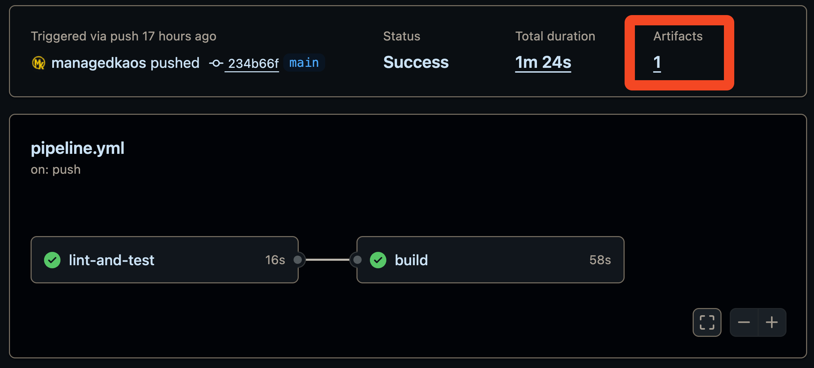

# 03_03 Building and Managing Artifacts

After verifying our code with linting and tests, the next step is to build our application and manage the resulting artifacts.

In this lesson, you'll learn how GitHub Actions supports artifact creation and management, with a focus on building a container image and storing it securely in the GitHub Package Registry.

## Overview

In this lab, you'll:

- Review what build artifacts are and why they’re important.
- Add a new `build` job to your existing workflow.
- Configure permissions to allow publishing to the GitHub Container Registry (GHCR).
- Use Docker actions to build and push a container image.
- Verify that your container image appears in the repository's **Packages** section.

## Understand Build Artifacts

Before diving into the workflow, take a moment to understand what we mean by "build artifacts":

- A build artifact is a compiled or bundled version of your application, ready for distribution or deployment.
- Examples include:

  - Executables from a C++ project
  - Archives like `.zip`, `.tar`, or `.jar` files
  - Docker images built from your application code

In this project, our build artifact is a **Docker image** that will be pushed to the GitHub Container Registry.

## References

Follow the links below for more information on the actions used in this pipeline:

- [Docker Setup Buildx](https://github.com/marketplace/actions/docker-setup-buildx)
- [Docker Login](https://github.com/marketplace/actions/docker-login)
- [Docker Metadata](https://github.com/marketplace/actions/docker-metadata-action)
- [Build and Push Docker Images](https://github.com/marketplace/actions/build-and-push-docker-images)
- [Jobs Step IDs](https://docs.github.com/en/actions/reference/workflows-and-actions/workflow-syntax#jobsjob_idstepsid)

## Instructions

> [!IMPORTANT]
> Before proceeding with this lab, please complete the steps in the previous lesson: [Linting and Unit Tests](../03_02_linting_unit_tests/README.md)

1. Navigate to your repository on GitHub.
1. Open the GitHub web editor (`github.dev`).
1. In the `.github/workflows` directory, open your workflow file. It should already contain a job named `lint-and-test`.
1. Add the `build` job.

    You’re now going to add a new job named `build` directly after `lint-and-test`. This job will:

    - Depend on `lint-and-test` to complete first.
    - Build a Docker image.
    - Push that image to the GitHub Container Registry.

    Append the following job to your existing workflow file:

      ```yaml
        build:
          needs: lint-and-test
          runs-on: ubuntu-latest

          permissions:
            packages: write

          steps:
            - uses: actions/checkout@v4

            - name: Setup Docker buildx
              uses: docker/setup-buildx-action@v3

            - name: Log into ghcr.io
              uses: docker/login-action@v3
              with:
                registry: ghcr.io
                username: ${{ github.actor }}
                password: ${{ secrets.GITHUB_TOKEN }}

            - name: Extract Docker metadata
              id: meta
              uses: docker/metadata-action@v5
              with:
                images: ghcr.io/${{ github.repository }}
                tags: |
                  type=sha,format=short,prefix=,suffix=
                  type=sha,format=long,prefix=,suffix=
                  type=ref,event=branch,prefix=,suffix=

            - name: Build and push the container image
              uses: docker/build-push-action@v6
              with:
                context: .
                platforms: linux/amd64, linux/arm64
                push: true
                tags: ${{ steps.meta.outputs.tags }}
                labels: ${{ steps.meta.outputs.labels }}
      ```

    The complete workflow should be similar to the workflow provided here: [pipeline.yml](./pipeline.yml)

1. Push the updated workflow file to GitHub.
1. Go to the **Actions** tab and wait for the workflow to complete.
1. Confirm that the `lint-and-test` job runs first and is followed by the `build` job.

    

1. Once the build job completes successfully, go to your repository’s **Code** tab.
1. On the right-hand side of the page, find the **Packages** section.
1. Select the container image listed (it should be named similarly to your repository).
1. You should see information about the container image, including version tags and metadata.

## Shenanigans

After running this workflow you may notice that an artifact is listed on the summary page.



But this is not the artifact we seek!  We're building a container image and storing it as an artifact in the GitHub Container Registry.

The artifact on the summary page -- and the associated build summary -- are created by the `docker/build-push-action` action.

Docker's official GitHub Actions, specifically the "Build and push Docker images" (docker/build-push-action) and "Docker Buildx Bake" (docker/bake-action), automatically generate a job summary for your Docker builds within GitHub Actions.

This Docker Build Summary provides a high-level overview of the build execution and key metrics, including:

- **Summary of Build Execution**: Details about the Dockerfile used, the total build duration, and cache utilization.
- **Build Inputs**: Information on build arguments, tags, labels, and build contexts used during the process.
- **Bake Definition (if applicable)**: For builds utilizing docker/bake-action, the full Bake definition used for the build is included.
- **Performance Metrics**: A high-level view of build performance, such as build duration and cache utilization.
- **Link to Build Record**: The summary also includes a link to download the build record, which contains more detailed information like build stats, logs, and outputs. This build record can be imported into Docker Desktop for deeper inspection and analysis.

This summary enhances visibility into your Docker builds within GitHub Actions, providing insights into build performance and aiding in troubleshooting. The summaries are enabled by default but can be disabled via the DOCKER_BUILD_SUMMARY environment variable if necessary.

Exploring this feature is beyond the scope of this course but you can find more details via the following link:

- [Docker's GitHub Actions Build Summary](https://docs.docker.com/build/ci/github-actions/build-summary/)

<!-- FooterStart -->
---
[← 03_02 Linting and Unit Tests](../03_02_linting_unit_tests/README.md) | [03_04 Testing →](../03_04_testing/README.md)
<!-- FooterEnd -->
