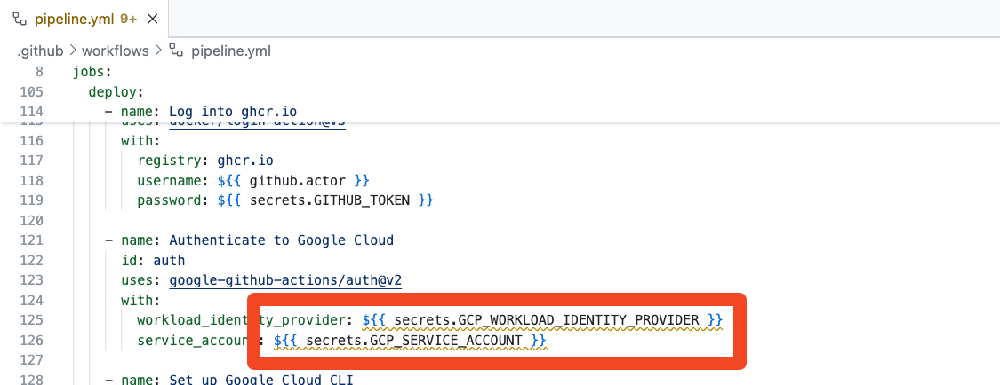

# 03_05 Deploying

We’ve reached the final stage of the CI/CD pipeline: deployment.

In this lesson, you’ll learn how to take the container image built and tested in previous jobs and deploy it to a cloud platform—in this case, Google Cloud Platform (GCP).

You’ll configure your GitHub Actions workflow to authenticate with GCP, push the container image to the GCP Artifact Registry, and deploy it using Cloud Run.

## References

- [Learning Google Cloud Run](https://www.linkedin.com/learning/learning-google-cloud-run)

## Overview

This lab walks you through:

- Setting up the GCP environment
- Preparing your secrets for GCP authentication
- Reviewing the `deploy` job configuration in the existing workflow
- Understanding how the workflow pushes the container to GCP
- Watching how the deployment is performed via GitHub Actions
- Verifying the live application with a final test step

## Instructions

> [!IMPORTANT]
> Before proceeding with this lab, please complete the steps in the previous lesson: [Testing](../03_04_testing/README.md))

> [!IMPORTANT]
> If you are not planning to use a cloud service (ie, Google Cloud) in this lab, skip steps 1 and 2 below and fast forward to the ["Escape Hatch"](#escape-hatch) step. If you are planning to use AWS or Azure, take a look at the ["Shenanigans"](#shenanigans) section at the end of this document for future updates.  Then fast forward to the ["Escape Hatch"](#escape-hatch) in step 3.

### Step 1: Configure Your Google Cloud Platform (GCP) Environment

Use the steps in the following document to setup and configure your Google Cloud environment:

- [Setup Google Cloud](./google_cloud/SETUP_GOOGLE_CLOUD.md)

### Step 2: Add Google Cloud Secrets to the Repository {#add-google-cloud-secrets}

After completing Step 1, log in to GitHub and navigate to your repository.

1. Go to your repository's **Settings** tab.
1. Navigate to **Secrets and variables > Actions > Repository secrets**.
1. Select **New repository secret** and create a secrets for each of the values printed by the script in Step 1:

| Secret Name | Description |
| ----------- | ----------- |
| `GCP_PROJECT_ID` | Your GCP project ID |
| `GCP_REGION` | The region for Cloud Run (e.g., `us-central1`) |
| `GCP_REGISTRY_NAME` | Your Artifact Registry name (e.g., `mascot-api`) |
| `GCP_SERVICE_ACCOUNT` | The email of your GCP service account |
| `GCP_WORKLOAD_IDENTITY_PROVIDER` | The workload identity provider string for your GCP setup |

### Step 3: Update the workflow file

Add the following job to the workflow file:

```yaml
  deploy:
    needs: test-image
    runs-on: ubuntu-latest

    permissions:
      packages: read
      id-token: write

    steps:
    - name: Log into ghcr.io
      uses: docker/login-action@v3
      with:
        registry: ghcr.io
        username: ${{ github.actor }}
        password: ${{ secrets.GITHUB_TOKEN }}

    - name: Authenticate to Google Cloud
      id: auth
      uses: google-github-actions/auth@v2
      with:
        workload_identity_provider: ${{ secrets.GCP_WORKLOAD_IDENTITY_PROVIDER }}
        service_account: ${{ secrets.GCP_SERVICE_ACCOUNT }}

    - name: Set up Google Cloud CLI
      uses: google-github-actions/setup-gcloud@v2

    - name: Configure Docker
      run: gcloud auth configure-docker ${{ secrets.GCP_REGION }}-docker.pkg.dev

    - name: Pull the image from GitHub Container Registry
      run: docker pull ghcr.io/${{ github.repository }}:${{ github.sha }}

    - name: Tag the image for GCP Container Registry
      run: |
        docker tag ghcr.io/${{ github.repository }}:${{ github.sha }} \
          ${{ secrets.GCP_REGION }}-docker.pkg.dev/${{ secrets.GCP_PROJECT_ID }}/${{ secrets.GCP_REGISTRY_NAME }}/${{ env.SERVICE_NAME }}:${{ github.sha }}
        docker image ls

    - name: Push the tagged image to GCP Container Registry
      run: docker push ${{ secrets.GCP_REGION }}-docker.pkg.dev/${{ secrets.GCP_PROJECT_ID }}/${{ secrets.GCP_REGISTRY_NAME }}/$SERVICE_NAME:${{ github.sha }}

    - name: Deploy to Cloud Run service
      uses: google-github-actions/deploy-cloudrun@v2
      with:
        service: ${{ env.SERVICE_NAME }}
        region: ${{ secrets.GCP_REGION }}
        image: ${{ secrets.GCP_REGION }}-docker.pkg.dev/${{secrets.GCP_PROJECT_ID}}/${{ secrets.GCP_REGISTRY_NAME }}/${{ env.SERVICE_NAME }}:${{ github.sha }}
        flags: '--allow-unauthenticated'

    - name: Test the Live Application
      run: |
        DEPLOY_URL=$(gcloud run services describe $SERVICE_NAME --platform=managed --region=${{ secrets.GCP_REGION }} --format='value(status.url)')
        echo "Testing DEPLOY_URL: ${DEPLOY_URL}"
        curl --silent --fail ${DEPLOY_URL}/health
        curl --silent --fail ${DEPLOY_URL}/05024756-765e-41a9-89d7-1407436d9a58
```

In the `pipeline.yml`, scroll to the `deploy` job section and review the following:

- **Job Dependencies**: The `deploy` job runs *after* the `test-image` job (`needs: test-image`).
- **Permissions**: The job requires `packages: read` and `id-token: write` for authentication and access.
- **Steps**:

  - Logs into GitHub Container Registry.
  - Authenticates to Google Cloud using the provided secrets.
  - Sets up the GCP CLI and configures Docker for GCP.
  - Pulls the image built earlier.
  - Tags and pushes the image to GCP Artifact Registry.
  - Deploys the image to a Cloud Run service.
  - Tests the live deployment with HTTP requests to validate the service is running correctly.

### Escape Hatch

If you're not deploying to a cloud platform, you can replace the `deploy` job in your workflow file with this simulated version.

It skips the authentication and deployment steps but still demonstrates how deployment jobs are structured.

```yaml
  deploy:
    needs: test-image
    runs-on: ubuntu-latest

    permissions:
      packages: read
      id-token: write

    steps:
    - name: Log into GitHub Container Registry
      uses: docker/login-action@v3
      with:
        registry: ghcr.io
        username: ${{ github.actor }}
        password: ${{ secrets.GITHUB_TOKEN }}

    - name: Pull the image from GitHub Container Registry
      run: docker pull ghcr.io/${{ github.repository }}:${{ github.sha }}

    - name: Tag the image
      run: |
        echo "Tag image for cloud deployment"
        docker tag ghcr.io/${{ github.repository }}:${{ github.sha }} fake.registry.local/${{ github.repository }}:${{ github.sha }
        docker image ls

    - name: Simulate Pushing to Remote Registry
      run: |
        echo "Push fake.registry.local/${{ github.repository }}:${{ github.sha }"
        sleep 2

    - name: Deploy to cloud service 😉
      run: |
        echo "Deploy to cloud service..."
        sleep 2
        echo "Deployment complete."

    - name: Test the Live Application
      run: |
        echo "Testing DEPLOY_URL: https://fake.run.app"
        echo "HTTP 200 OK - /health"
        echo '{"mascots_loaded":10,"service":"mascot","status":"healthy"}'
        echo "HTTP 200 OK - /05024756-765e-41a9-89d7-1407436d9a58"
        echo '{"guid":"05024756-765e-41a9-89d7-1407436d9a58","latlong":"42.026111,-93.648333","location":"Ames, IA, USA","mascot":"Cy","nickname":"Cyclones","school":"Iowa State University"}'
```

This approach ensures the pipeline runs end-to-end without error, making it ideal for including a `deploy` job without connecting to a real cloud environment.

### Step 4: Run the Workflow

1. Push your changes to GitHub.
1. Go to the **Actions** tab and monitor the run titled **Pipeline**.
1. Expand the `deploy` job and review each step as it completes.
1. Confirm that the final step (testing the live app) completes successfully.

### Step 5: Troubleshooting Notes

- **Warnings in the GitHub web editor for secret variables**:  When viewing the `deploy` job in the GitHub web editor, warnings will appear under variables using the YAML syntax for secrets.  The message will read: "Context access might be invalid: ...".  This is caused by the editor not being able to determine the scope of the variable being referenced as a secret.  *These warnings can be safely ignored*.

  

- Use the ["Escape Hatch"](#escape-hatch) deploy job if you can't get your workflow steps to authenticate with the cloud provider.

## SHENANIGANS

Right now the lab is set up to work with GCP.  In the future, directions for the following may be added:

- Set up AWS and deploying to App Runner.
- Set up Azure and deploying to Azure Container Services.

<!-- FooterStart -->
---
[← 03_04 Testing](../03_04_testing/README.md) | [03_06 Add a Workflow Status Badge →](../03_06_add_a_workflow_status_badge/README.md)
<!-- FooterEnd -->
