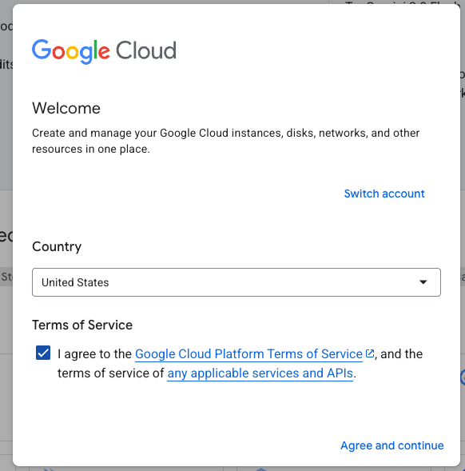
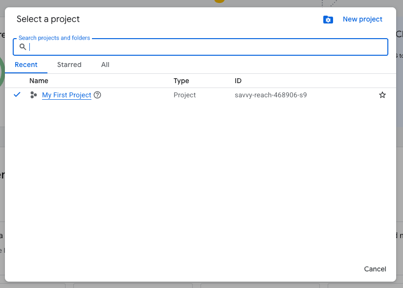
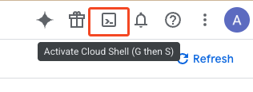
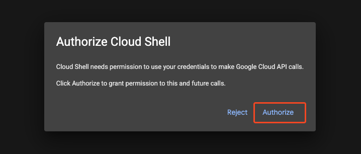
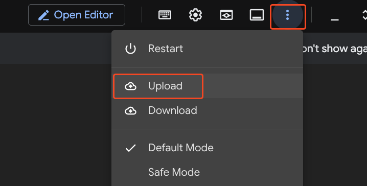

# Setup Google Cloud

In this lab, you will configure your Google Cloud Platform (GCP) environment to support automated deployments to Google Cloud Run from GitHub Actions.

You will perform the setup using the Google Cloud Shell, which provides a browser-based terminal environment.

The focus of this lab is to enable secure, short-lived credentials using Workload Identity Federation instead of long-lived service account keys.

You will configure:

- GCP APIs and infrastructure for Cloud Run deployments
- A Workload Identity Pool and Provider
- A GitHub-connected service account with appropriate permissions
- Artifact Registry for storing container images
- The required GitHub repository secrets to support automated deployment

## Overview

You will complete the following high-level steps:

1. Sign into Google Cloud and launch the Cloud Shell
1. Run the provided script to enable or create Google Cloud services and resources including:

    - Identity and Access Management
    - Artifact/Container Registry
    - Cloud Run
    - Identity federation components (pool and provider)
    - A service account for GitHub Actions

## Step-by-Step Instructions

### Step 1: Sign Into Google Cloud

1. Log into your Google account, or [follow this link to create one](https://accounts.google.com/signup).
1. If needed, [sign up for the GCP free trial](https://console.cloud.google.com/freetrial/signup).
1. Navigate to the [Google Cloud Console](https://console.cloud.google.com/).
1. Accept the terms if prompted.

    

1. Create a new project or use the default project created when you first logged in.

    

   - To create a project, enter "Create project" in the search bar.
   - Select **Create a Project**.
   - Enter a project name and select **Create**.

1. Select the terminal icon in the top-right corner to **Activate Cloud Shell**.

    

1. Authorize Cloud Shell to make API calls on your behalf.

    

### Step 2: Run the Cloud Shell Configuration Script

In the terminal menu bar, select the three-dot menu, then select **Upload**.



1. Confirm the **File** option is selected then select **Choose Files**.
1. Browse to the location where the exercise files are downloaded on your local system and select [`setup-google-cloud.sh`](./setup-google-cloud.sh).
1. Select **Upload**.

    

1. When the upload completes, make the script executable by running the following command in the terminal:

    ```bash
    chmod +x ./setup-google-cloud.sh
    ```

1. Run the script:

    ```bash
    ./setup-google-cloud.sh
    ```

1. Wait for the script to complete and make a note of the final lines of output.

    It should be similar to the following:

    ```yaml
    GCP_PROJECT_ID = YOUR_PROJECT_ID
    GCP_REGION = YOUR_SELECTED_REGION
    GCP_REGISTRY_NAME = YOUR_REGISTRYNAME
    GCP_SERVICE_ACCOUNT = YOUR_SERVICE_ACCOUNT_NAME
    GCP_WORKLOAD_IDENTITY_PROVIDER = YOUR_WORKLOAD_IDENTITY_PROVIDER_NAME
    ```

> [!TIP]
> If the script reports errors or any of the output values are blank, try running the script again. Running the script a second time may be needed if the requests to GCP time out.
>
> Running the script a second time should create or fix anything that was not created in the first pass.
>
> If the output remains blank, review the errors and your input values.  Attempt to resolve the errors if possible or proceed to the ["Escape Hatch"](../README.md#escape-hatch) in step 3.

Make a note of these values and proceed with the next step for the lab: [Step 2: Add Google Cloud Secrets to the Repository](../README.md#add-google-cloud-secrets).
