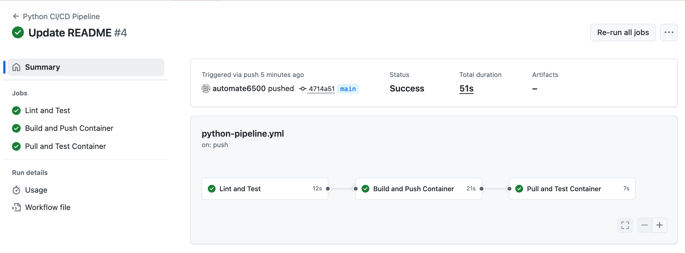
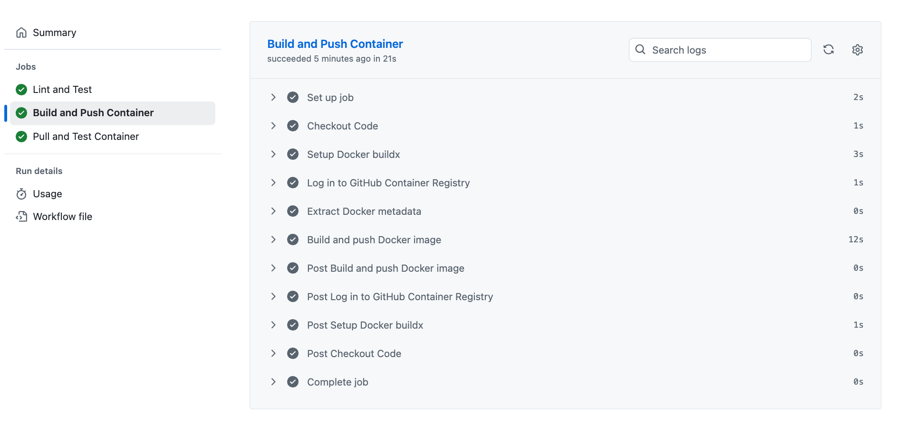
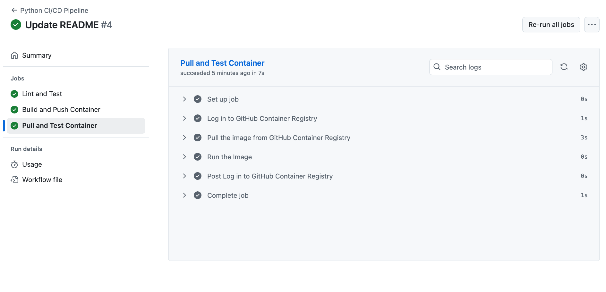
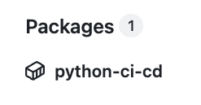
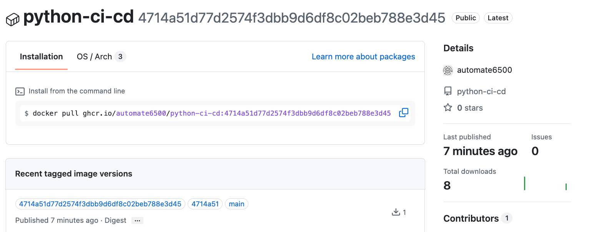

# 03_08 Solution: Develop a CI/CD Pipeline for a Python Script

In this challenge, you’ll develop a GitHub Actions workflow for a Python script.

The goal is to build a full CI/CD pipeline that includes linting and tests, artifact creation, and artifact testing.

You’ll also configure your workflow to use the GitHub Container Registry (GHCR) to store and retrieve the image.

## Overview

You will complete the following steps in this challenge:

1. **Create a new GitHub repository** using the Python `.gitignore` template
2. **Use the repository in the GitHub Web Editor** to add code and workflows
3. **Add the provided files**:

   - [`hello.py`](./hello.py) (Python script)
   - [`Dockerfile`](./Dockerfile) (for building the image)
   - [`.dockerignore`](./.dockerignore) (for building the image)
   - [`python-pipeline.yml`](./python-pipeline.yml) (your CI/CD workflow)

4. **Implement a three-stage pipeline**:

   - Lint and test the Python code
   - Build and push the container image to GHCR
   - Pull and run the image to verify output

    ```mermaid
    graph LR
        A[Lint and test the Python code] --> B[Build and push the container image to GHCR]
        B --> C[Pull and run the image to verify output]
    ```

5. **Push changes to the repository** and confirm the workflow runs successfully

This challenge should take about 15 minutes to complete.

## Instructions

### Create a New Repository

1. Go to [https://github.com](https://github.com) and select **New repository**
2. Name the repository (e.g., `python-ci-cd`)
3. Choose **Public** or **Private** visibility
4. Select **Add .gitignore** and choose the **Python** template
5. Select **Create repository**

### Add Files to the Repository in the GitHub Web Editor

1. Press the `.` key in your new repo or navigate to `https://github.dev/your-user-name/you-repo-name`
2. Add the following files to your repo.
   - ***NOTE: Be sure to place the workflow file in the correct location.***
3. Commit all files to your repo and push the changes.

- `hello.py`

```python
print("Hello, world!")
```

- `Dockerfile`

```Dockerfile
FROM python:3.13-slim

COPY hello.py .

CMD ["python", "hello.py"]
```

- `.dockerignore`

```shell
.github
.git
.gitignore
README.md
```

- `python-pipeline.yml`

```yaml
name: Python CI/CD Pipeline

on: [push, workflow_dispatch]

jobs:
  lint-and-test:
    name: 🔬Lint and Test
    runs-on: ubuntu-latest
    steps:
      - name: Checkout Code
        uses: actions/checkout@v4

      - name: Set up Python
        uses: actions/setup-python@v5
        with:
          python-version: "3.13"

      - name: Install requirements
        run: pip install flake8 pylint

      - name: Lint hello.py
        run: |
          flake8 hello.py
          pylint hello.py

      - name: Test the script
        run: python hello.py | grep -i hello || exit 1

  build-and-push:
    name: 📦 Build and Push Container
    needs: lint-and-test
    runs-on: ubuntu-latest
    permissions:
      packages: write
      contents: read

    steps:
      - name: Checkout Code
        uses: actions/checkout@v4

      - name: Setup Docker buildx
        uses: docker/setup-buildx-action@v3

      - name: Log in to GitHub Container Registry
        uses: docker/login-action@v3
        with:
          registry: ghcr.io
          username: ${{ github.actor }}
          password: ${{ secrets.GITHUB_TOKEN }}

      # Extract metadata (tags, labels) for Docker
      # https://github.com/docker/metadata-action
      - name: Extract Docker metadata
        id: meta
        uses: docker/metadata-action@v5
        with:
          images: ghcr.io/${{ github.repository }}
          tags: |
            type=sha,format=short,prefix=,suffix=
            type=sha,format=long,prefix=,suffix=
            type=ref,event=branch,prefix=,suffix=

      # Build and push Docker image with Buildx
      # https://github.com/docker/build-push-action
      - name: Build and push Docker image
        uses: docker/build-push-action@v5
        with:
          context: .
          push: true
          platforms: linux/amd64, linux/arm64
          tags: ${{ steps.meta.outputs.tags }}
          labels: ${{ steps.meta.outputs.labels }}


  test-image:
    name: 🔁 Pull and Test Container
    needs: build-and-push
    runs-on: ubuntu-latest
    permissions:
      packages: read
    steps:
      - name: Log in to GitHub Container Registry
        uses: docker/login-action@v3
        with:
          registry: ghcr.io
          username: ${{ github.actor }}
          password: ${{ secrets.GITHUB_TOKEN }}

      - name: Pull the image from GitHub Container Registry
        run: docker pull ghcr.io/${{ github.repository }}:${{ github.sha }}

      - name: Run the Image
        run: docker run --rm ghcr.io/${{ github.repository }}:${{ github.sha }} | grep -i hello || exit 1
```

### Review Workflow Results

#### Review workflow results

1. Go to the **Actions** tab to confirm the workflow starts.
1. Verify that all stages completed successfully.
1. Select the most recent run triggered by your push.

   

1. Review the logs for each job.

   

   

   

1. From the repository home page, confirm that the image was pushed to GHCR.

   

   

<!-- FooterStart -->
---
[← 03_07 Challenge: Develop a CI/CD Pipeline for a Python Script](../03_07_challenge_develop_a_cicd_pipeline_for_a_python_script/README.md) | [04_01 Plan a Custom Action →](../../ch4_developing_custom_actions/04_01_plan_a_custom_action/README.md)
<!-- FooterEnd -->
