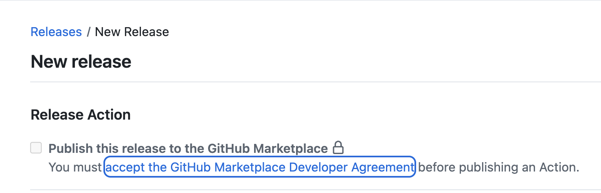
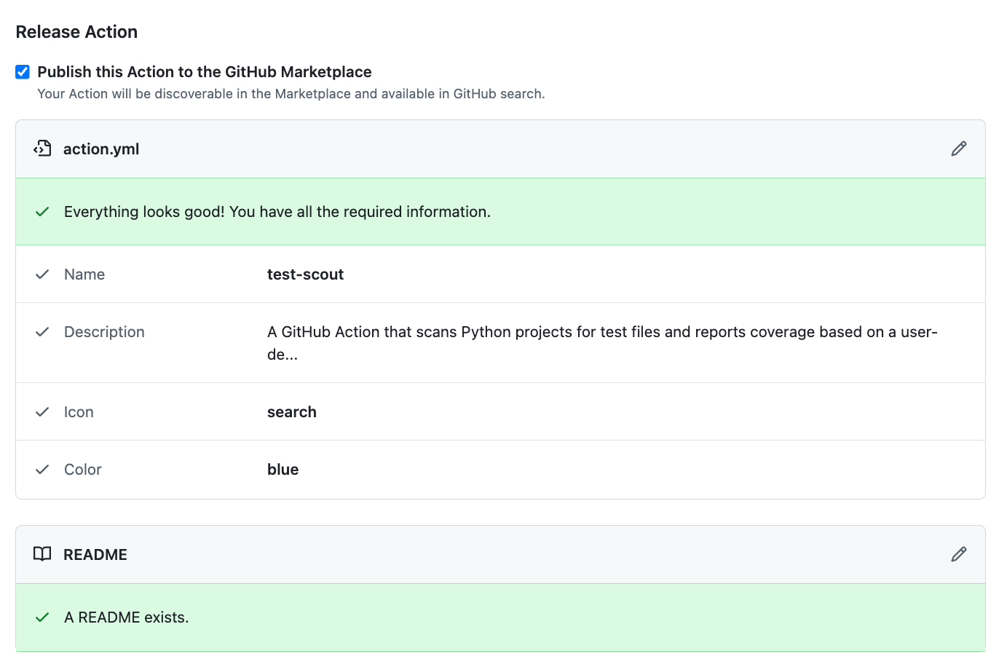
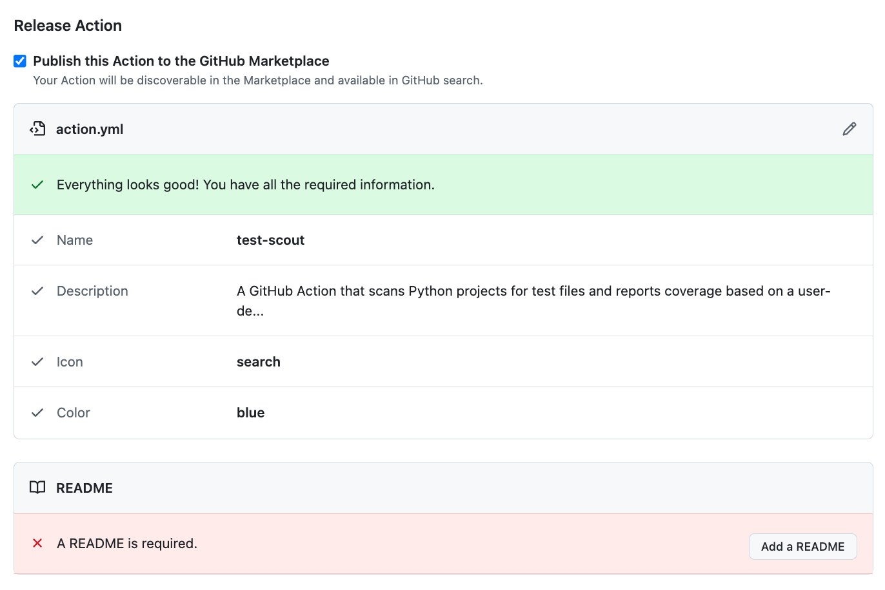

# 04_11 Publish an Action to the Marketplace

Publishing your custom GitHub Action to the Marketplace allows other developers to discover and reuse your work.

In this lesson, you’ll learn the steps and requirements for making your action publicly available.

## Overview

In this lesson, you will:

- Review the requirements for publishing a GitHub Action to the Marketplace.
- Prepare and validate your repository for release.
- Create a tagged release and complete the Marketplace publishing form.

## Instructions

### Step 1: Verify prerequisites

Before publishing, make sure you meet the following requirements:

- [ ] **Two-factor authentication (2FA)** must be enabled on your GitHub account.

  Visit [https://github.com/settings/security](https://github.com/settings/security) to configure this.

- [ ] **Marketplace Developer Agreement** must be accepted.

  

  You will be prompted to accept the agreement the first time you attempt to create a release that publishes the action to the marketplace.

- [ ] The repository containing your action must include:

  - [ ] A valid `Dockerfile`
  - [ ] A working `entrypoint.sh` script
  - [ ] A well-structured `action.yml`
  - [ ] A `README.md` with a description, inputs, and usage examples

### Step 2: Create a new release

1. Navigate to your repository’s homepage on GitHub.
2. Select **Releases > Draft a new release**.
3. Complete the form:

    - **Tag version**: `v1.0`
    - **Release title**: `v1.0 for the Marketplace`
    - **Description**: `First time publishing.`

4. Ensure the checkbox **“Publish this release to the GitHub Marketplace”** is selected.
5. GitHub will run validation on your action metadata and README.

    

    If there are any issues, they’ll appear on the release page and must be fixed before proceeding.

    

### Step 3: Choose Marketplace details

1. Select a **primary category** (e.g., *Continuous Integration*).
2. Select a **secondary category** (e.g., *Utilities*).
3. Select **Publish release**.

### Step 4: Confirm the listing

Once published:

- Your action will be publicly listed on the [GitHub Marketplace](https://github.com/marketplace).
- The **README.md** file becomes the homepage for your action.
- A green **“Use latest version”** button allows others to add your action to their workflows.

You can **delist** the action at any time using the link at the bottom of the Marketplace page.

> [!IMPORTANT]
> Delisting an action only removes it from search in the Marketplace. The action remains usable if the repository is still public.

<!-- FooterStart -->
---
[← 04_10 Deploy a Custom Action](../04_10_deploy_a_custom_action/README.md) | [04_12 Challenge: Create a Custom Action →](../04_12_challenge_create_a_custom_action/README.md)
<!-- FooterEnd -->
